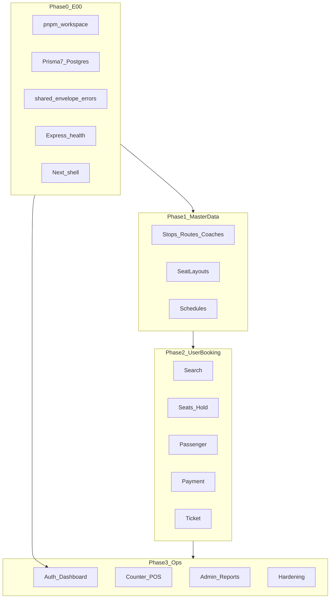

# Full Platform Implementation Plan

## Current state

Workspace is **docs-only** (15 files): [AGENTS.md](AGENTS.md), [docs/ARCHITECTURE.md](docs/ARCHITECTURE.md), [docs/FEATURES.md](docs/FEATURES.md), [docs/CONTRACTS.md](docs/CONTRACTS.md), [docs/contracts/](docs/contracts/). No `apps/` or `packages/` yet.

**Your choices:** Docker Compose for Postgres; **full scope** (E00–E12).

---

## Target repository layout

```
online-bus-ticket/
├── apps/api/              # Express, modular monolith
├── apps/web/              # Next.js App Router (public + counter + admin)
├── packages/database/     # Prisma 7 + prisma.config.ts
├── packages/shared/       # Zod contracts, DTOs, errors, envelope
├── packages/config/       # Shared eslint/tsconfig (optional, E00-02)
├── docker-compose.yml
├── pnpm-workspace.yaml
└── .env.example
```




---

## Phase 0 — Epic E00: Foundation (first deliverable)

Implement all tasks in [docs/FEATURES.md](docs/FEATURES.md) E00-01–E00-08 in one cohesive scaffold PR (acceptable for greenfield).


| Task      | Deliverable                                                                                                                                                    |
| --------- | -------------------------------------------------------------------------------------------------------------------------------------------------------------- |
| E00-01    | Root `package.json`, `pnpm-workspace.yaml`, workspace packages                                                                                                 |
| E00-02    | `packages/config` or root: ESLint, Prettier, TS `strict`, path aliases `@repo/shared`, `@repo/database`                                                        |
| E00-03–04 | `packages/database`: Prisma 7, `prisma.config.ts`, `schema.prisma` (`User`, `Role`, `createdAt`/`updatedAt`), export client                                    |
| E00-05    | `apps/api`: Express, `GET /api/v1/health`, request-id middleware, module folder skeleton                                                                       |
| E00-06    | `apps/web`: Next.js 15 App Router, layout, `NEXT_PUBLIC_API_URL`                                                                                               |
| E00-07    | **Contract-first:** `packages/shared` — `error-codes.ts`, `AppError`, `envelope.ts`, `health.dto.ts`; API error handler returns `{ error: { code, message } }` |
| E00-08    | `docs/contracts/health.md`; optional `tenantId` on base model comment pattern in schema                                                                        |


**Docker:** `docker-compose.yml` with Postgres 16, volume, port `5432`; root scripts `pnpm db:up`, `pnpm db:migrate`, `pnpm dev` (concurrent api + web via `turbo` or `pnpm -r`).

**Health contract (before API code):**

- `packages/shared/src/dtos/health.dto.ts` — `{ status: 'ok', version, timestamp }`
- `docs/contracts/health.md`
- Controller returns `{ data: HealthDto }`

**Prisma 7 notes:** Use `prisma.config.ts` in [packages/database](packages/database) with `datasource.url` from `DATABASE_URL`; run `prisma generate` post-install; driver per Prisma 7 docs (PostgreSQL adapter if required by your installed version).

---

## Phase 1 — Master data & scheduling (E02 → E04)

**Order:** E02 → E03 → E04 (per [docs/FEATURES.md](docs/FEATURES.md)).

For each micro-task:

1. Zod in `packages/shared`
2. `docs/contracts/{module}/*.md`
3. Prisma migration (if `db` layer)
4. API module: `routes → controller → service → repository`
5. Admin/counter UI when task says `web`

**E02 highlights:**

- Models: `Stop`, `Route` (slug `dhaka-pabna`), `Coach`, enums `BusType`
- Admin CRUD under `/api/v1/admin/`* with `requireRole('ADMIN')`
- Seed: Dhaka–Pabna sample data (E02-08)

**E03:** `SeatLayout`, `SeatTemplate`; `GET /api/v1/schedules/:id/seat-map` (structure first)

**E04:** `Schedule`, `RescheduleLog`; create/reschedule/cancel; counter + admin UI

---

## Phase 2 — Public booking MVP (E05 → E09)

Core user flow from your spec.


| Epic | Contract files (create first)                                                                                      | API                     | Web                                        |
| ---- | ------------------------------------------------------------------------------------------------------------------ | ----------------------- | ------------------------------------------ |
| E05  | `search-schedules.schema.ts`, `schedule-card.dto.ts` ([existing doc](docs/contracts/schedule/search-schedules.md)) | `GET /schedules/search` | Search form + `/search/[routeSlug]/[date]` |
| E06  | `seat-map.dto.ts`, `create-hold.schema.ts`                                                                         | hold + seat-map         | Expandable seat map, boarding, price       |
| E07  | `passenger.schema.ts`, `booking.dto.ts`                                                                            | `POST /bookings`        | Passenger form                             |
| E08  | `initiate/confirm` payment schemas                                                                                 | mock payment adapter    | Payment page                               |
| E09  | `ticket/lookup.schema.ts`, `ticket.dto.ts`                                                                         | lookup + PDF/HTML       | `/ticket` download                         |


**Domain rules (enforce in services):**

- Trip date `>= today` (Asia/Dhaka) — shared `isValidTripDate()` in `packages/shared`
- Seat lifecycle: AVAILABLE → HELD (10m TTL) → SOLD
- Guest checkout: `userId` null, phone required
- Ticket lookup: `passengerNumber` + `phone`, rate-limited, generic 404

---

## Phase 3 — Identity (E01)

Can run **in parallel after E00** but dashboard needs E07 bookings.

- JWT httpOnly cookies; `authenticateOptional` / `authenticateRequired`
- `GET /users/me/bookings` + `/dashboard`

---

## Phase 4 — Counter POS (E10)

- `CounterTransaction` audit table
- `COUNTER_SELLER` RBAC
- Endpoints: sell, change, refund, cancel (same inventory/payment rules as online)
- `/counter` POS UI optimized for keyboard

---

## Phase 5 — Admin reporting (E11)

- Sales report + analytics overview + CSV export
- `/admin/reports` charts (date range, route, channel split)

---

## Phase 6 — Hardening (E12)

- Rate limits (auth + ticket lookup)
- Cron/job: expire seat holds
- Structured logging (pino)
- E2E: search → hold → pay → ticket
- OpenAPI from Zod (optional)
- Docker Compose: api + web + postgres single command

---

## Implementation conventions (every PR)

From [AGENTS.md](AGENTS.md) and [.cursor/rules/contracts.mdc](.cursor/rules/contracts.mdc):

- One micro-task ID per PR when possible (e.g. `E06-05` only)
- No cross-module `repository` imports; use `*.ports.ts` between modules
- API responses: `{ data }` / `{ error: { code, message } }`
- Web never imports Prisma
- Update checkbox in [docs/FEATURES.md](docs/FEATURES.md) when done
- Commit format: [docs/GIT-WORKFLOW.md](docs/GIT-WORKFLOW.md) (`feat(booking): ...`)

---

## API module map (create folders in E00, flesh out per epic)

```
apps/api/src/modules/
  identity/     # E01
  schedule/     # E02, E04, E05
  inventory/    # E03, E06 (seat map / holds)
  booking/      # E06, E07
  payment/      # E08
  ticket/       # E09
  counter/      # E10
  admin/        # E02 admin CRUD, E11 reports
```

---

## Suggested session breakdown (full scope)


| Session | Epics   | Outcome                              |
| ------- | ------- | ------------------------------------ |
| 1       | E00     | `pnpm dev` works; health + Docker DB |
| 2       | E02     | Master data + seed                   |
| 3       | E03–E04 | Layouts + schedules                  |
| 4       | E05–E06 | Search + seat selection              |
| 5       | E07–E09 | Checkout + payment + ticket          |
| 6       | E01     | Auth + dashboard                     |
| 7       | E10     | Counter POS                          |
| 8       | E11     | Reports                              |
| 9       | E12     | Production hardening                 |


---

## Defaults (no blocker)

- Timezone: `Asia/Dhaka`
- Payment: mock adapter interface (swap later for bKash/SSLCommerz)
- Single tenant (document `tenantId` pattern only in E00-08)
- Refund: full before departure unless you specify otherwise later

---

## First action after plan approval

Execute **Phase 0 (E00)** end-to-end: monorepo scaffold, Docker Postgres, Prisma 7, shared contracts (envelope + errors + health DTO), Express health endpoint, Next.js shell, `.env.example`, root README quick-start update.