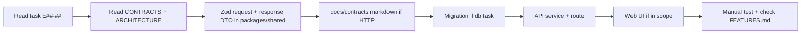

# AI Agent Guide — Online Bus Ticket Platform

This file is the **primary instruction set** for AI coding agents (Cursor, Copilot, etc.). Read it before any implementation work.

## Project Summary

SaaS bus ticketing: public web booking (guest or logged-in), counter POS, admin scheduling and analytics.

**Stack:** TypeScript, Express (`apps/api`), Next.js (`apps/web`), Prisma 7 + PostgreSQL (`packages/database`), Zod (`packages/shared`).

**Architecture:** Modular monolith. See [docs/ARCHITECTURE.md](docs/ARCHITECTURE.md).  
**Contracts:** Contract-first. See [docs/CONTRACTS.md](docs/CONTRACTS.md).

---

## Mandatory Rules

### 0. Contract before code (non-negotiable)

For every micro-task that touches HTTP or shared types:

1. Add/update Zod schemas in `packages/shared` (request + response DTO).
2. For new endpoints, add or update `docs/contracts/{module}/{endpoint}.md`.
3. Only then implement API and/or web.

**Never** implement a controller or client fetch without the Zod contract existing in the same PR (or a prior contract-only PR).

### 1. One micro-task at a time

- Pick a single task ID from [docs/FEATURES.md](docs/FEATURES.md) (e.g. `E05-03`).
- Do not start unrelated epics in the same PR.
- Mark the task `[x]` in `docs/FEATURES.md` when complete.

### 2. Respect module boundaries

```
apps/api/src/modules/{booking|schedule|payment|identity|counter|admin|reporting}/
  routes.ts
  controller.ts
  service.ts
  repository.ts
```

- **Never** import another module's `repository.ts`.
- Cross-module calls go through the other module's **service** or **port interface** (`*.ports.ts`); DTOs from `packages/shared`.

### 3. Validation & contracts

- All inputs: Zod schemas in `packages/shared/src/schemas/`.
- All HTTP outputs: DTO Zod schemas in `packages/shared/src/dtos/`; wrap in `{ data }` envelope.
- Export inferred types: `export type SearchSchedulesInput = z.infer<typeof searchSchedulesSchema>`.
- Reject past trip dates on server always.
- Web app imports types/schemas from `@repo/shared` — no duplicate API interfaces in `apps/web`.

### 4. Database changes

- Edit `packages/database/prisma/schema.prisma`.
- Run migrate; review SQL.
- Follow Prisma naming: `createdAt`, `updatedAt`, `@@index` on filter columns.
- One migration per micro-task when possible.

### 5. No business logic in UI

- React: display + form state only.
- Pricing, availability, eligibility: API only.

### 6. Security

- `ADMIN` / `COUNTER_SELLER` routes: `authenticateRequired` + `requireRole(...)`.
- Public ticket lookup: rate limit; return generic 404 on mismatch (no enumeration).
- Do not commit secrets.

### 7. Errors

Use shared `AppError`:

```typescript
throw new AppError('SEAT_NOT_AVAILABLE', 'Seat already sold', 409);
```

### 8. Transactions

Seat hold, payment confirm, refund: use `prisma.$transaction`.

### 9. URLs (user-facing)

- Search results: `/search/[routeSlug]/[date]` with filter query params.
- Do not invent alternate URL schemes without updating docs.

### 10. Git

Follow [docs/GIT-WORKFLOW.md](docs/GIT-WORKFLOW.md).  
**Do not commit unless the user asks.**

---

## Implementation Workflow



### Per-task checklist

- [ ] Task ID stated in PR / commit
- [ ] **Contract:** request schema + response DTO in `packages/shared`
- [ ] **Contract doc:** `docs/contracts/...` updated (HTTP endpoints)
- [ ] Migration applied (if db)
- [ ] API returns `{ data }` / `{ error }` per contract
- [ ] Web uses `@repo/shared` types (no duplicate interfaces)
- [ ] Role checks on protected routes
- [ ] No cross-module repository imports
- [ ] `docs/FEATURES.md` checkbox updated

---

## Code Conventions

| Item | Convention |
|------|------------|
| Files | kebab-case filenames, PascalCase classes |
| API routes | plural nouns, REST, `/api/v1/` prefix |
| Enums | `SCREAMING_SNAKE` in Prisma and TS |
| Money | store as integer minor units |
| Dates | ISO 8601 UTC in API JSON |
| IDs | UUID for internal; `passengerNumber` for customer-facing |

### Folder naming

```
packages/shared/src/
  schemas/       # HTTP request / query / params
  dtos/          # HTTP response shapes
  enums/
  errors/
  api/           # envelope helpers

apps/api/src/
  modules/
  middleware/
  lib/

apps/web/src/
  app/              # App Router
  components/
  lib/api-client.ts
```

---

## API Response Shape

```typescript
// Success
{ "data": T }

// Error
{ "error": { "code": "SEAT_NOT_AVAILABLE", "message": "..." } }

// Paginated
{ "data": T[], "meta": { "page", "pageSize", "total" } }
```

---

## Key Domain Rules

1. **Trip date** must be `>= today` (server validation).
2. **Seat states:** AVAILABLE → HELD (TTL) → SOLD, or AVAILABLE → SOLD (counter direct).
3. **Guest checkout:** `userId` null on booking; phone required.
4. **Ticket download:** requires matching `passengerNumber` + `phone`.
5. **Cancelled schedule:** no new holds; existing bookings handled per policy in E04.
6. **Filters:** `busType`, `timePeriod`, `seatClass` combine with AND logic.
7. **Flat fare:** `STANDARD`, `PREMIUM`, and `BUSINESS` are layout/filter labels only — every seat on a schedule uses `schedule.baseFare` (`priceForScheduleSeat` in `@repo/shared`).

---

## What NOT to Do

- Do not add Redis, Kafka, or microservices unless a task explicitly says so.
- Do not put Prisma calls in Next.js Server Actions without going through API (keep DB access in API only for consistency).
- Do not skip Zod "because TypeScript is enough".
- Do not implement API/UI before the contract exists in `packages/shared`.
- Do not implement payment provider-specific code without the adapter interface.
- Do not create mega-PRs spanning multiple epics.

---

## Reference Docs

| Doc | Use when |
|-----|----------|
| [docs/CONTRACTS.md](docs/CONTRACTS.md) | Contract-first workflow, envelopes, versioning |
| [docs/contracts/](docs/contracts/) | Per-endpoint contract specs |
| [docs/ARCHITECTURE.md](docs/ARCHITECTURE.md) | Boundaries, flows, data model |
| [docs/DESIGN-PRINCIPLES.md](docs/DESIGN-PRINCIPLES.md) | Quality bar |
| [docs/README.md](docs/README.md) | Documentation index |
| [docs/FEATURES.md](docs/FEATURES.md) | What to build next |
| [docs/GIT-WORKFLOW.md](docs/GIT-WORKFLOW.md) | Commits and PRs |

---

## Starting a Session (Agent Prompt Template)

```
Implement micro-task E05-03 from docs/FEATURES.md.
Read AGENTS.md, docs/CONTRACTS.md, and docs/contracts/schedule/search-schedules.md first.
Deliver in order: (1) Zod contract in packages/shared, (2) API implementation, (3) curl example.
Do not implement E05-04 or other tasks.
```

---

## Questions to Ask the User

Only when blocked:

- Payment provider choice (bKash, SSLCommerz, Stripe, etc.)
- Timezone for "today" (default: Asia/Dhaka)
- Refund policy rules (partial vs full)
- Multi-tenant: single org first or `tenantId` from day one

Default assumptions if unanswered: **Asia/Dhaka**, **mock payment**, **single tenant**, **full refund before departure** (document in code comments).
