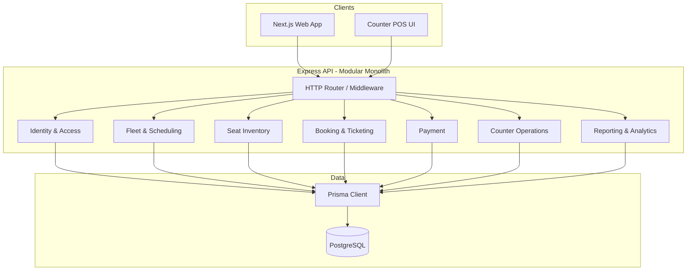
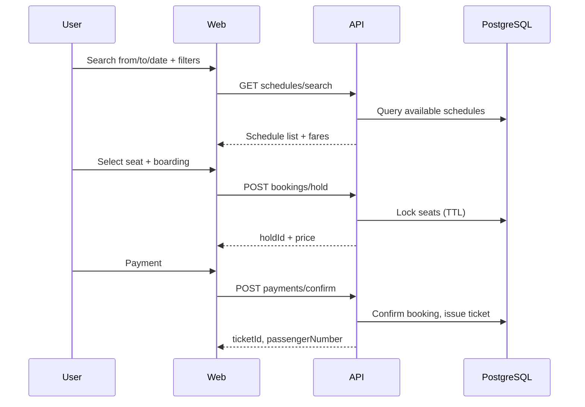

# Architecture

## Goals

1. **Monolith first** — one deployable API + one web app, fast to build and operate.
2. **Microservice-ready** — clear bounded contexts, no cross-module DB access, stable API contracts.
3. **Human maintainable** — predictable folder layout, shared validation, explicit dependencies between epics.

---

## High-Level Diagram



---

## Repository Layout (Monorepo)

```
online-bus-ticket/
├── apps/
│   ├── api/                 # Express HTTP server
│   └── web/                 # Next.js (public + counter + admin UIs)
├── packages/
│   ├── database/            # Prisma schema, migrations, generated client
│   ├── shared/              # Zod schemas, DTOs, enums, error codes
│   └── config/              # ESLint, TSConfig (optional)
├── docs/
├── AGENTS.md
└── package.json             # pnpm workspaces
```

**Rule:** `apps/*` may import `packages/*`. `packages/*` must not import `apps/*`. Modules inside `apps/api` talk through **service interfaces**, not direct imports of another module's Prisma queries.

---

## Bounded Contexts (Future Microservices)

| Context | Owns | Future service name |
|---------|------|---------------------|
| **Identity & Access** | Users, sessions, roles, permissions | `identity-service` |
| **Fleet & Scheduling** | Routes, stops, coaches, schedules, reschedules | `schedule-service` |
| **Seat Inventory** | Seat maps, availability, holds | `inventory-service` |
| **Booking & Ticketing** | Reservations, tickets, passenger refs | `booking-service` |
| **Payment** | Payments, refunds, provider webhooks | `payment-service` |
| **Counter Operations** | POS flows, cash sales, counter audit | `counter-service` (or part of booking) |
| **Reporting** | Aggregates, exports, dashboards | `reporting-service` |

Each context exposes:

- **HTTP routes** under a versioned prefix: `/api/v1/{context}/...`
- **Application services** (use cases) — no business logic in route handlers
- **Repository layer** — Prisma access only inside that module's `repositories/`

---

## API Layering (Express)

```
Route → Controller → Service → Repository → Prisma
         ↓
    Zod validate (packages/shared)
```

- **Controllers:** HTTP in/out, status codes, call one service method.
- **Services:** Transactions, business rules, orchestration.
- **Repositories:** Queries scoped to one aggregate (e.g. `ScheduleRepository`).

Use **Prisma transactions** for: seat lock + booking create + payment record.

---

## Contract-First (HTTP & Modules)

Implementation order for every endpoint:

1. **Zod** request schema + response DTO in `packages/shared`
2. **Spec** in `docs/contracts/{module}/{endpoint}.md`
3. **API** controller + service + repository
4. **Web** client using `@repo/shared` types

Cross-module calls use **port interfaces** (`booking.ports.ts`) and shared DTOs — not foreign repositories.

Full guide: [CONTRACTS.md](CONTRACTS.md) · Endpoint index: [contracts/README.md](contracts/README.md)

---

## Web App (Next.js)

| Area | Route pattern | Audience |
|------|---------------|----------|
| Search | `/` or `/search` | Public |
| Results | `/search/[routeSlug]/[date]` | Public (query: `?search=...` aligned with spec) |
| Seat select | `/booking/[scheduleId]` | Public |
| Payment | `/booking/[scheduleId]/payment` | Public |
| Ticket download | `/ticket` (passenger # + phone) | Public |
| User dashboard | `/dashboard` | Logged-in user |
| Counter POS | `/counter/*` | Counter seller |
| Admin | `/admin/*` | Admin |

Use **Server Components** for read-heavy pages; **Client Components** for seat map, filters, and POS interactions.

Call API via typed fetch wrapper; validate responses with Zod where critical.

---

## Core Domain Flows

### 1. Public ticket purchase (guest or logged-in)



### 2. Ticket download (no login)

- Input: `passengerNumber` + `phone` (must match booking record).
- Output: ticket PDF or printable view (QR optional in later epic).

### 3. Counter sale

- Seller enters passenger info → selects schedule/seats (same inventory rules) → payment method `CASH` | `ONLINE` → ticket issued.
- Change / refund / cancel go through **Counter Operations** with audit log.

### 4. Admin scheduling

- CRUD schedules; reschedule updates `departureAt` and notifies dependent bookings per policy (micro-task defines rules).

---

## Data Model (Conceptual)

> Implement in `packages/database/prisma/schema.prisma` per epic. Names are indicative.

| Entity | Notes |
|--------|--------|
| `User` | Optional for guest checkout; phone unique for lookup |
| `Role` | `USER`, `COUNTER_SELLER`, `ADMIN` |
| `Stop` / `Route` | From/to; route slug for URL e.g. `dhaka-pabna` |
| `Coach` | Coach number, bus type (AC / NON_AC) |
| `Schedule` | Route + coach + departure, ETA, status |
| `SeatLayout` | Template per coach type |
| `Seat` | Position, class (STANDARD, PREMIUM, BUSINESS) |
| `SeatHold` | Temporary lock with `expiresAt` |
| `Booking` | Links schedule, seats, passenger, seller (nullable) |
| `Ticket` | `passengerNumber`, status, PDF ref |
| `Payment` | Amount, method, status, provider ref |
| `CounterTransaction` | Audit for sell/change/refund/cancel |
| `RescheduleLog` | Old/new schedule, reason |

**Indexes:** `(routeId, departureDate)`, `(scheduleId, seatId)`, `(passengerNumber, phone)`, `(bookingId, status)`.

---

## Search & URL Contract

**Search query (client):**

- `from`, `to`, `date` (ISO date, `>= today` in user TZ or server TZ — document in shared util)
- Filters: `busType`, `timePeriod` (MORNING | NOON | AFTERNOON | NIGHT), `seatClass`

**Results URL (spec):**

```
/search/[routeSlug]/[date]?search=...
```

Example: `/search/dhaka-pabna/2026-05-20?busType=AC&timePeriod=MORNING&seatClass=BUSINESS`

**Schedule card fields:** coach number, start, departure time, end, estimate duration, bus type, fare, available seats, “Select seat” CTA.

---

## Cross-Cutting Concerns

| Concern | Approach |
|---------|----------|
| **Auth** | JWT access + refresh; optional auth middleware on booking |
| **Authorization** | RBAC middleware: `requireRole('ADMIN')` |
| **Validation** | Zod in `packages/shared`; parse at API boundary |
| **Errors** | Stable `code` + `message` JSON; map Prisma errors in repository |
| **Idempotency** | Payment confirm uses `Idempotency-Key` header |
| **Seat concurrency** | DB row lock or `SELECT FOR UPDATE` on seat rows in transaction |
| **Observability** | Structured logs (pino), request ID; metrics later |
| **Multi-tenancy (SaaS)** | Optional `tenantId` on all tenant-scoped tables from Epic 00 |

---

## Scaling Path (Monolith → Microservices)

1. **Phase 1:** Modular monolith (current).
2. **Phase 2:** Extract read-heavy **Reporting** to separate service + read replica.
3. **Phase 3:** Extract **Payment** (webhooks, PCI boundary).
4. **Phase 4:** Extract **Inventory** + **Booking** if traffic demands.

**Preconditions for extraction:**

- Module already has its own routes + service + repo.
- No foreign imports between modules (use HTTP events or message bus later).
- Shared package only has types/Zod, not Prisma.

---

## Environment

```env
DATABASE_URL=
JWT_SECRET=
API_URL=http://localhost:4100
WEB_URL=http://localhost:3000
PAYMENT_PROVIDER_API_KEY=   # when integrated
```

---

## Security Checklist

- Rate-limit ticket lookup by phone + passenger number.
- Never expose full phone in APIs; mask in UI.
- Counter and admin routes always authenticated + role-checked.
- Validate date server-side (reject past dates).
- Sanitize route slugs; authorize schedule access by ID.

---

## Definition of Done (per micro-task)

- Zod schemas in `packages/shared`
- API route + service + repository
- Prisma migration if schema changes
- Web UI wired to API (if UI task)
- Manual test steps in PR description
- No cross-module repository imports
