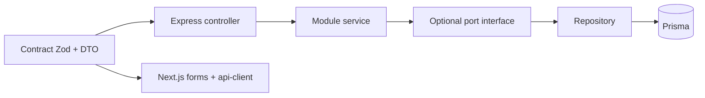

# Contract-First Development

All features are built **contract before implementation**. The contract is the agreement between web clients, the API, and (later) extracted services.

**Source of truth:** Zod schemas and TypeScript types in `packages/shared`.  
**Human-readable spec (optional per task):** `docs/contracts/{module}/{endpoint}.md`

---

## Contract Layers

| Layer | Location | Purpose |
|-------|----------|---------|
| **HTTP** | `packages/shared/src/schemas/`, `src/dtos/` | Request/response shapes, validation, client types |
| **Module ports** | `apps/api/src/modules/{name}/{name}.ports.ts` | In-process calls between bounded contexts |
| **Persistence** | `packages/database/prisma/schema.prisma` | Tables, enums, indexes (not exposed to web) |



---

## Mandatory Order (Every Micro-Task)

1. **Define contract** — Zod input + output DTOs in `packages/shared`
2. **Document** (if HTTP) — short `docs/contracts/...md` or update existing
3. **Implement API** — controller parses with Zod; service returns DTO shape
4. **Implement web** — import same schemas/types; no duplicate interfaces in `apps/web`
5. **Verify** — example curl/fetch in contract doc or PR test plan

**Do not** merge API or UI code for a new endpoint without merged Zod contracts in the same PR (or a prior PR that only adds the contract).

---

## Folder Layout (`packages/shared`)

```
packages/shared/src/
  schemas/           # Request: body, query, params
    schedule/
      search-schedules.schema.ts
  dtos/              # Response shapes (Zod or z.object for runtime parse)
    schedule/
      schedule-card.dto.ts
  enums/             # Shared enums (mirror Prisma where needed)
  errors/            # ErrorCode enum + AppError helpers
  api/               # Envelope helpers, pagination meta
  index.ts           # Public exports
```

### Naming

| Kind | File pattern | Export pattern |
|------|--------------|----------------|
| Request body | `create-booking.schema.ts` | `createBookingSchema` |
| Query/params | `search-schedules.schema.ts` | `searchSchedulesQuerySchema` |
| Response | `schedule-card.dto.ts` | `scheduleCardSchema`, `ScheduleCardDto` |
| Inferred type | — | `export type ScheduleCardDto = z.infer<typeof scheduleCardSchema>` |

---

## HTTP Envelope (Standard)

All JSON responses use these envelopes — define once in `packages/shared/src/api/envelope.ts`:

```typescript
// Success
{ "data": T }

// Error
{ "error": { "code": ErrorCode, "message": string, "details"?: unknown } }

// Paginated list
{ "data": T[], "meta": { "page": number, "pageSize": number, "total": number } }
```

Controllers wrap service results with `data`. Never return raw Prisma models on the wire.

---

## Error Contract

| Field | Rule |
|-------|------|
| `code` | Stable machine string from `ErrorCode` enum (e.g. `SEAT_NOT_AVAILABLE`) |
| `message` | Safe for UI; no stack traces |
| HTTP status | 400 validation, 401 auth, 403 forbidden, 404 not found, 409 conflict, 422 business rule |

Document new codes in `packages/shared/src/errors/error-codes.ts` when adding endpoints.

---

## Versioning & Breaking Changes

- Base path: `/api/v1/`
- **Non-breaking:** add optional fields, new endpoints, new enum values (if clients ignore unknown)
- **Breaking:** rename/remove fields, change types, change error codes → new `/api/v2/` or version header (prefer path)

When breaking:

1. Update Zod schema + DTO
2. Update `docs/contracts/` doc
3. Note in PR and `docs/FEATURES.md` if epic behavior changes

---

## Module Port Contracts (Internal)

When module A calls module B (e.g. Payment → Booking), depend on an **interface**, not B's repository.

```typescript
// apps/api/src/modules/booking/booking.ports.ts
export interface IBookingReader {
  getBookingForPayment(bookingId: string): Promise<BookingPaymentViewDto>;
}

// apps/api/src/modules/booking/booking.service.ts
export class BookingService implements IBookingReader { ... }
```

- DTOs for port methods live in `packages/shared/src/dtos/`
- Payment module imports `IBookingReader` only

---

## Per-Task Contract Checklist

Copy into PR description:

```markdown
## Contract (task E##-##)
- [ ] Request schema: `packages/shared/src/schemas/...`
- [ ] Response DTO: `packages/shared/src/dtos/...`
- [ ] Error codes listed (if any new)
- [ ] docs/contracts/... updated (HTTP endpoints)
- [ ] API implements envelope `{ data }` / `{ error }`
- [ ] Web uses shared types (no duplicate interfaces)
```

---

## Contract Index by Epic

| Epic | Contract files (create as you implement) |
|------|------------------------------------------|
| E00 | `envelope.ts`, `error-codes.ts`, `health.dto.ts` |
| E01 | `auth/register.schema.ts`, `auth/login.schema.ts`, `user.dto.ts` |
| E05 | `schedule/search-schedules.schema.ts`, `schedule/schedule-card.dto.ts` |
| E06 | `booking/seat-map.dto.ts`, `booking/create-hold.schema.ts` |
| E07 | `booking/passenger.schema.ts`, `booking/booking.dto.ts` |
| E08 | `payment/initiate.schema.ts`, `payment/confirm.schema.ts` |
| E09 | `ticket/lookup.schema.ts`, `ticket/ticket.dto.ts` |
| E10 | `counter/sell.schema.ts`, `counter/refund.schema.ts` |

See [docs/contracts/README.md](contracts/README.md) for endpoint-level docs.

---

## OpenAPI (Swagger)

Modular YAML under `apps/api/openapi/` (one file per module). Served at `/api-docs` when the API runs (`ENABLE_SWAGGER=false` to disable). See `apps/api/openapi/README.md`.

---

## Example: Search Schedules (E05)

**Request** (`searchSchedulesQuerySchema`):

- `fromStopId`, `toStopId` (UUID)
- `date` (ISO date string, `>= today`)
- Optional: `busType`, `timePeriod`, `seatClass`

**Response** (`searchSchedulesResponseSchema`):

```typescript
{
  data: ScheduleCardDto[]  // coachNumber, departureAt, fare, availableSeats, ...
}
```

**Errors:** `ROUTE_NOT_FOUND`, `INVALID_DATE`

Full write-up: [docs/contracts/schedule/search-schedules.md](contracts/schedule/search-schedules.md)
